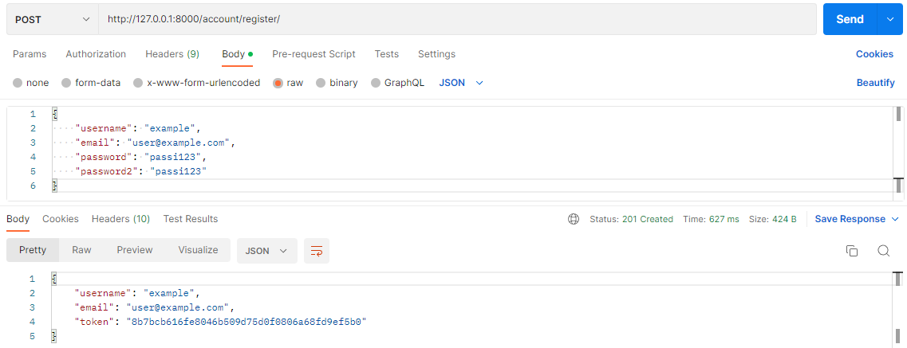
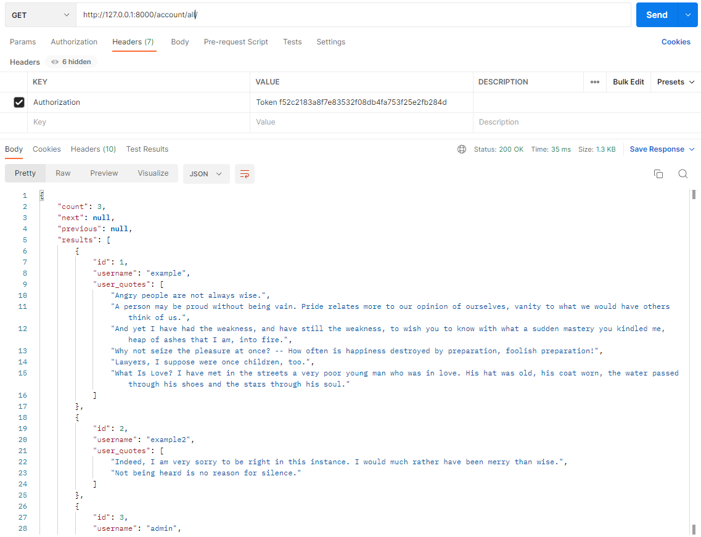
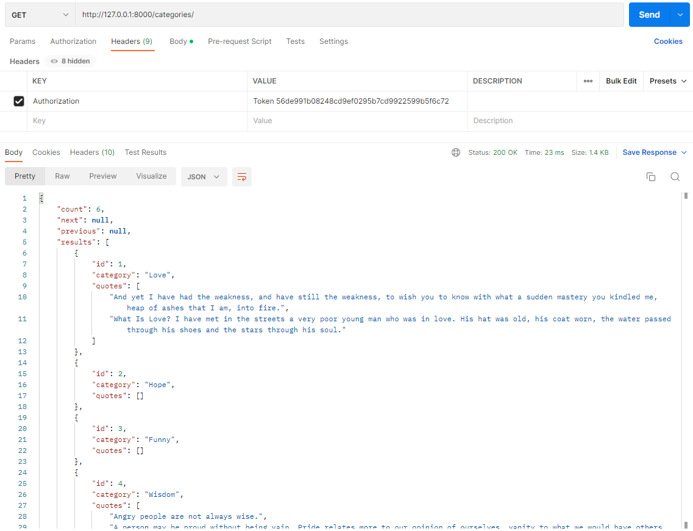
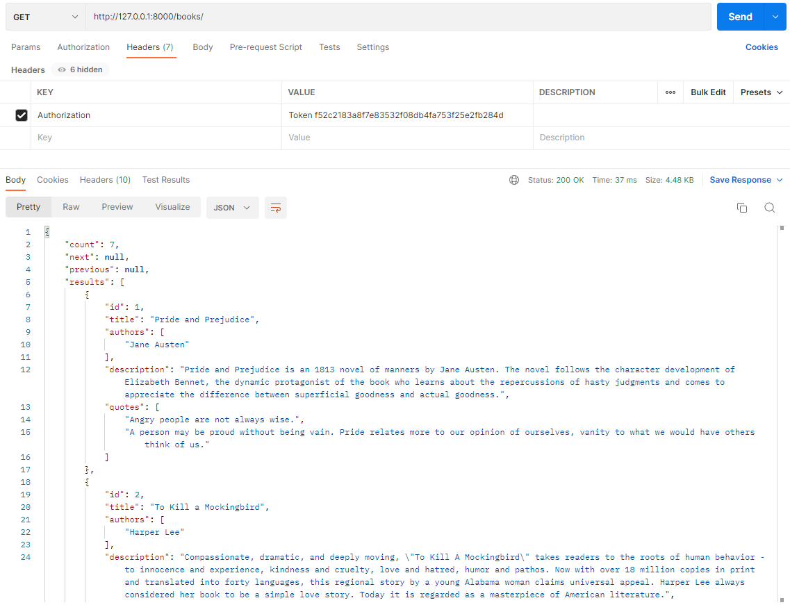
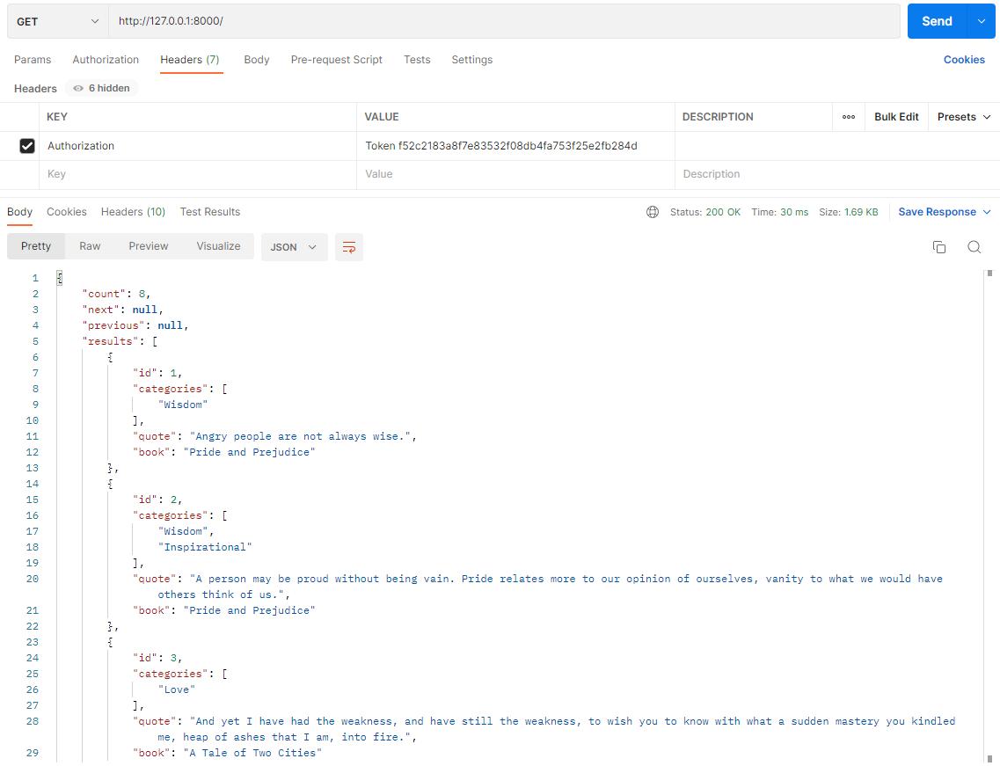

# Book quotes API
> REST API to store and keep track of books, authors, and quotes.

### Roles
- **Admin**: can add/change/fetch/remove quote/book/author objects.  
- **User**: can add/fetch quote objects, can change/remove only their own objects.

## API endpoints
<sub>*Uses Django token authentication.  
Methods in bold are only accessable by admins.  
Methods in italic are only accessable by users and apply only to their respective objects.*</sub>

### User endpoints  
`http://localhost:5000/account/`
| Endpoint  | HTTP methods | Description |
| --- | --- | --- |
| `register/` | `POST` |
| `change-password/` | *`POST`* |
| `login/` | `POST` | Enter username & password to log in |
| `logout/` | *`GET`* |
| `user/` | *`GET`* | Get logged-in user's profile |
| `all/` | `GET` | Get all existing profiles |
| `all/<pk>/` | `GET` |

### Quotes endpoints
`http://localhost:5000/`
| Endpoint  | HTTP methods | Description |
| --- | --- | --- |
| `authors/` | `GET` **`POST`** | Get list of authors (along with their books) |
| `authors/<pk>/` | `GET` **`PUT`** **`PATCH`** **`DELETE`** |
| `books/` | `GET` **`POST`** | Get list of books (along with their author(s) & quotes) |
| `books/<pk>/` | `GET` **`PUT`** **`PATCH`** **`DELETE`** |
| `categories/` | `GET` **`POST`** | Get list of categories (along with their respective quotes) |
| `categories/<pk>/` | `GET` **`PUT`** **`PATCH`** **`DELETE`** |
| ` ` | `GET` *`POST`* | Get list of quotes |
| `<pk>/` | `GET` *`PUT`* *`PATCH`* *`DELETE`* |

## Usage
- **Register**

- **Get all registered user profiles**

- **Get all categories**

- **Get all books**

- **Get all quotes**

- **Create quote**


## Installation
1. **Clone the repo**
```
git clone https://github.com/stealacamera/book-quotes-api.git
```
2. **Create and activate a virtual environment**
```
virtualenv <venv name>
<venv name>\Scripts\activate
```
3. **Install the dependencies**
```
pip install -r requirements.txt
```
4. **Run migrations and server**
```
python manage.py migrate
python manage.py runserver
```
